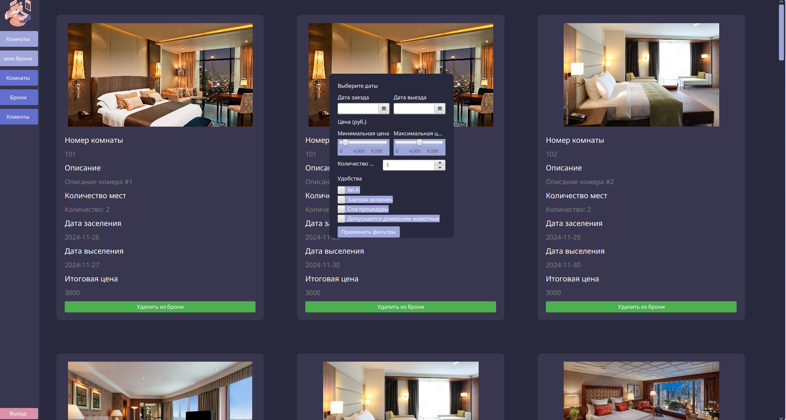
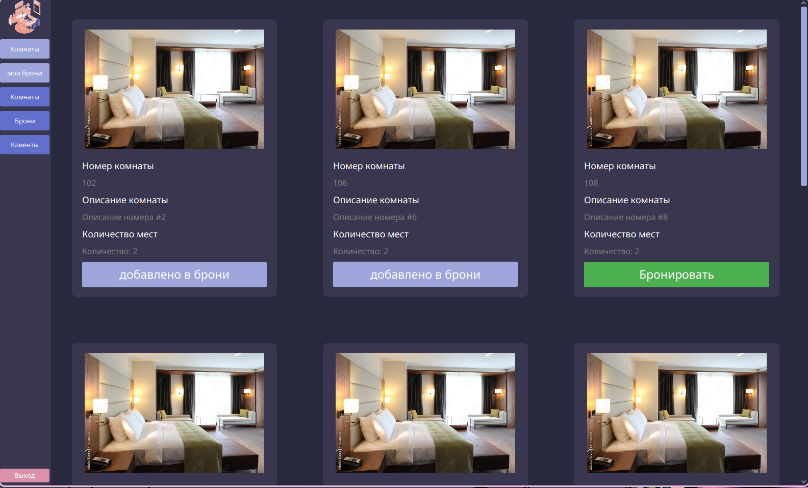

## Проектирование и разработка базы данных для бронирования отеля

## Описание проекта

Данный проект посвящен разработке базы данных для автоматизации процесса бронирования номеров в гостинице. Система будет обеспечивать многопользовательский доступ и разграничение функционала по ролям, что позволит эффективно управлять процессами как для клиентов, так и для сотрудников отеля.

## Технологии

- **JavaFX**: для разработки пользовательского интерфейса.
- **PostgreSQL**: в качестве системы управления базами данных.

## Требования к системе

## Общие требования

1. **Многопользовательский доступ**: система должна поддерживать одновременную работу нескольких пользователей.
2. **Разграничение функционала по ролям**: разные пользователи (клиенты и сотрудники) имеют различные уровни доступа и функционала.

## Функциональные требования

## Для клиентов

Клиенты и сотрудники отеля могут осуществлять следующие действия:

- **Получение информации о номерах**:
    
    - Оперативная информация о наличии, описании и свободных номерах на выбранные даты.
    
- **Подбор номера**:
    
    - Возможность подбора номера по заявленным критериям.
    
- **Информация о номерах и услугах**:
    
    - Доступ к детальной информации о номерах, дополнительных услугах и фото.
    
- **Отказ от брони**:
    
    - Клиент может отказаться от брони с указанием причины не позднее суток до заезда.
    

## Для сотрудников отеля

Сотрудники отеля могут выполнять следующие действия:

- **Управление справочниками**:
    
    - Добавление, удаление и редактирование данных в справочниках.
    
- **Оформление брони**:
    
    - Оформление брони и заказов на номера. В одном заказе может быть несколько номеров на указанное количество туристов (ФИО всех туристов должны быть указаны).
    
- **Динамическое ценообразование**:
    
    - Стоимость заказа рассчитывается динамически на основе различных факторов.
    

## Архитектура базы данных

Проект включает в себя разработку ER-диаграммы, которая будет отображать ключевые сущности, такие как клиенты, номера, бронирование и услуги. Это обеспечит эффективное управление данными и оптимизацию процессов обслуживания клиентов.

# Пример

